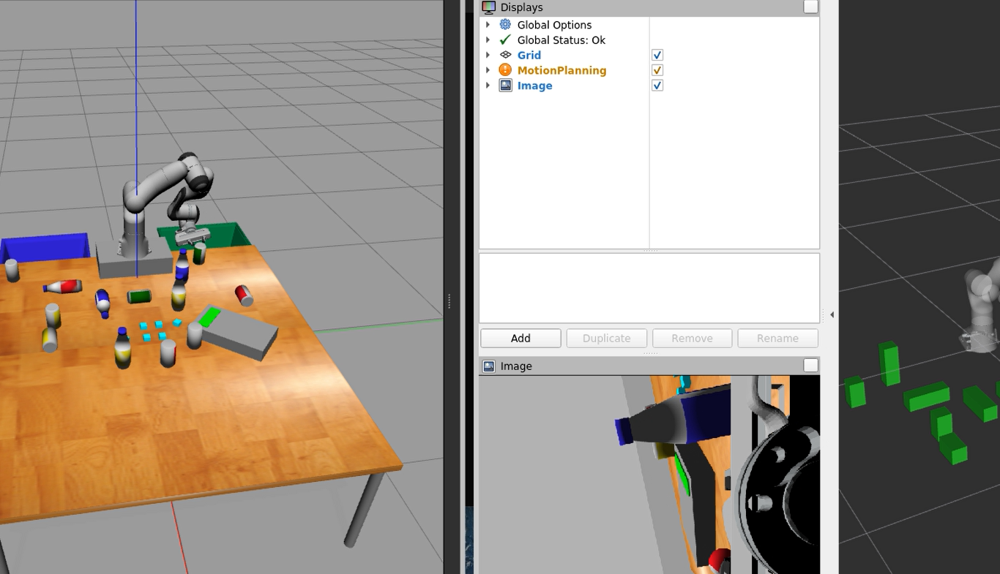

# Details of the files that complete the task

  - The `scan_procedure.py` file in Python is a ROS script that encapsulates the scanning procedure, i.e. it moves around the table taking in sensor input and building a model of the world around it (i.e. the planning scene). It uses the `moveit_commander` package to interact said planning scene. The script clears the planning scene, then iterates over a list of coordinates (which are locations and poses of recognised objects), creating a pose for each one using the `makePose` function, and publishing this pose. It also calls `get_xyz_uv` and `build_world` functions, to get sensor data, process it and update the world model. 
  - The `pick_place.py` file in Python is a ROS script that initializes a node named 'pick_drop'. It uses the `moveit_commander` package to interact with the planning scene that was made by the scan procedure file above. The script retrieves all known objects in the scene and their poses and then iterates over them. For each object, it calls a `pickPlacePipeline` method (presumably to pick up and place the object) and then removes the object from the world.
  - The other files are experimental, testing or observatory files, each of which either tests, or has a visualisation of the data output by numerous calculations. 

  To run the bot, we first run the `scan_procedure.py` file which makes the bot scan and build a world instance. Once this instance is built, we run the `pick_place.py` which uses this world instance to pick each object and drop it in the respective bins. 

### Youtube Video Link of Robot in Action

